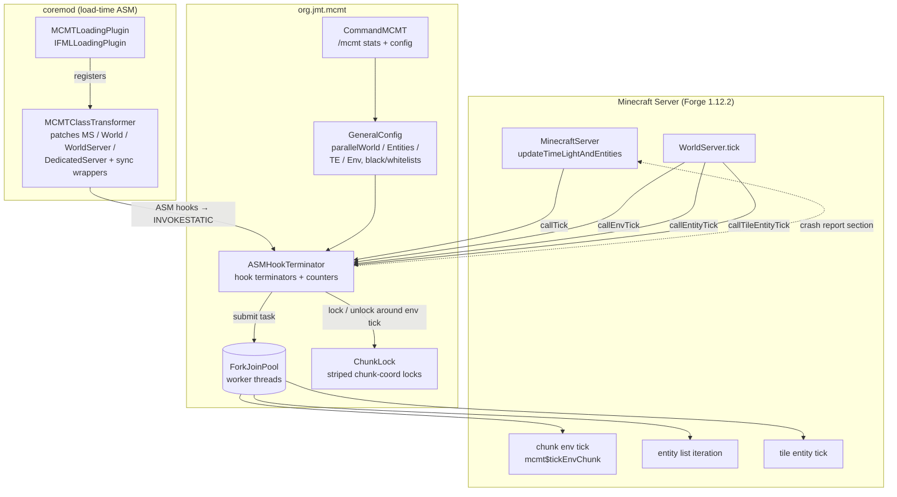

# MCMT — Minecraft Multi-Threading Mod (1.12.2 port)

A Forge mod that parallelises the Minecraft server tick loop — worlds, entities, tile entities, and environment (block-tick) processing — across a worker thread pool.

This repository is the **1.12.2 / Forge 14.23.5.2860** port (branch `1122`) of [jediminer543/JMT-MCMT](https://github.com/jediminer543/JMT-MCMT), which targets 1.15.2/1.16.x. The original 1.16 sources are kept under `deprecated/` as reference material.

## How it works

Vanilla ticks serially:

```py
def tick():
    for world in worlds:
        for chunk in world.loadedChunks: chunk.tickEnvironment()
        for entity in world.entities:    entity.tick()
        for te in world.tileEntities:    te.tick()
```

MCMT dispatches each of these loops onto a shared `ForkJoinPool`. Each loop is independently toggleable via config (`parallelWorld`, `parallelEntities`, `parallelTE`, `parallelEnv`). Concurrent access is guarded by:

- **`ChunkLock`** — a striped global lock keyed by chunk coordinates, used for env-chunk ticks so neighbouring chunks can't race on shared state (fluid flow, redstone wire updates).
- **Synchronized wrappers** injected by the coremod around `WorldServer` scheduled-tick access (`pendingTickListEntries*`) and `World` entity-list mutations (`loadedEntityList`, `unloadedEntityList`).
- **Graceful degradation** — on unsupported conditions (multiple servers, config kill-switch) the hooks fall back to vanilla serial execution instead of crashing.

## Architecture



## Port status

| Area | Status |
| --- | --- |
| Toolchain (JDK 8, ForgeGradle 2.3 fork, `stable_39` mappings) | ✅ |
| Coremod harness + binpatches | ✅ |
| Parallel world / entity / TE / env-chunk hooks | ✅ |
| Stats command + crash-report integration | ✅ |
| Synced wrappers (scheduled ticks, entity lists) | ✅ |
| serdes, JMX, syncfu, fastutil concurrent maps | ❌ not ported |

`parallelEnv`, `parallelEntities`, and `parallelTE` default to **false** — env ticks need the unported serdes serialisation, and entity/TE parallelism races against mods that iterate `loadedEntityList` (e.g. FoamFix CME crashes). Ship only the `reobfJar` output to production.

## Building

Requires JDK 8. From the repo root:

```sh
./gradlew build
```

The production jar lands in `build/libs/` (use the `reobfJar` artifact). Dev toolchain details live in `etc/buildscripts/`.

## Disclaimer

This mod rewrites Minecraft's internal processing loops with concurrency. Combined with other mods it may break; errors under this mod should not be reported to unrelated mod authors. The 1.12.2 port is experimental — test on a backup world first.
